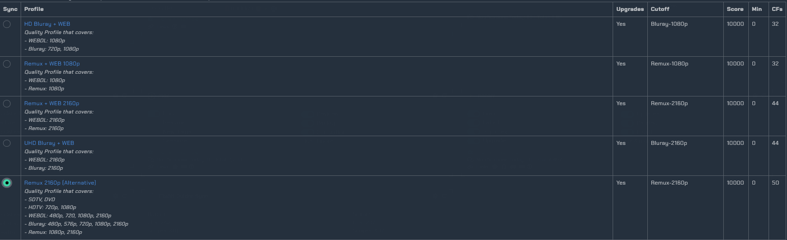
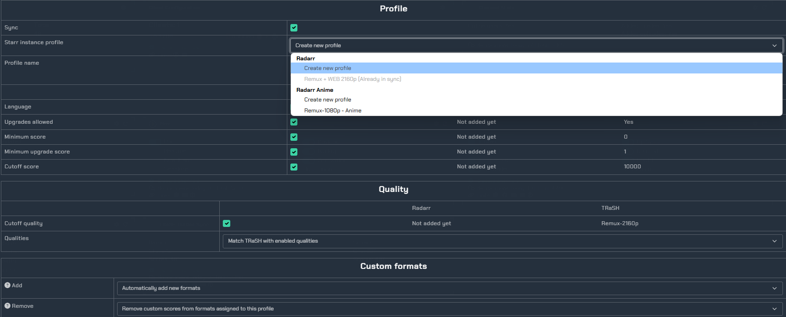
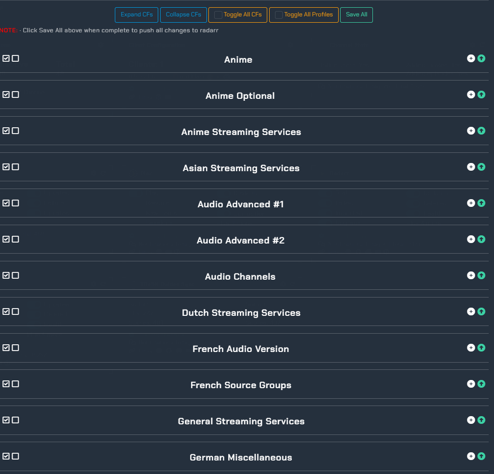

# TRaSH-Guides integration


[](https://ko-fi.com/davyjonesmedia/tip)

::: tip
👋🏼 If you need any assistance with this come find me on discord ***@thebropuks***
You can also visit the [notifiarr discord](https://discord.gg/nXuuUDMtGg) for any help or questions about the service. 
:::


### Notifiarr is a purpose built system to bring many applications together to manage and customize notifications via Discord. You can monitor many aspects of your network(s).
:::info
This guide will focus on setting up notifiarr & notifiarr client to achieve trash guides custom format syncing.
For our purpose, we will be using notifarr to sync trash guides custom formats to our *arrs instances, and keep them updated. They are updated quite frequently and it is advised to keep them up-to-date as to only get high quality releases.
:::

### Prerequisites

- Sonarr / Radarr
- A one time payment (or subscription) to receieve access to the trash guides integration 
- Basic Docker knowledge
- Portainer (optional, but recommended)

### Starting off
    
First, create an account with [Notifiarr](https://notifiarr.com/).
Navigate to [Support Project](https://notifiarr.com/sponsor.php) and make a one-time payment of at least $3 to gain access to the trash guides integration. 
 


## Notifiarr client setup
:::info
We are now going to start the notifiarr client to integrated sonarr / radarr to notifiarr.
:::

Add the notifiarr client to your pre-existing stack, or create a new one and compose up the client.

```yaml
services:
  notifiarr:
    container_name: notifiarr
    hostname: notifiarr
    image: golift/notifiarr
    restart: unless-stopped
    ports:
      - "5454:5454"
    volumes:
      - /opt/notifiarr:/config
      - /var/run/utmp:/var/run/utmp
      - /etc/machine-id:/etc/machine-id
```

Then navigate to your config file location (/opt/notifiarr/) and add your API key to the config.
You can find your API key [here](https://notifiarr.com/user.php?page=profile), using your global key.
You should also see a field to change your username and password. Set these as well

```
## This API key must be copied
from your notifiarr.com account.
api_key = "api-key-from-notifiarr.com"
```


Now, start the container. The config will be encrypted from here on, and will need to be further configured from inside the client's webUI.


## Configuring Notifiarr client
Navigate to the client (default port: 5454) and login.
Click on "Starr Apps" in the sidebar and configure your instances as seen below.
<ImageModal align="center">
    
</ImageModal>
Once you have populated all the required fields, make sure you hit "Save & Reload" at the bottom of the sidebar.

<ImageModal align="center">
    
</ImageModal>

## Enabling Trash Guides integration
:::info
You should now see the notifiarr client connected in notifiarr's dashboard with sonarr & radarr icons next to the client.
:::

Click on the cog of the "Add/Remove Integrations" section and scroll down to find and enable Trash Guides sync.
<ImageModal align="center">
    
</ImageModal>

Scroll all the way down and save your progress.
<ImageModal align="center">
    
</ImageModal>

Now, back on the integration setup page you will see the Trash Guides integration. Click on the cog to enter the settings menu.
<ImageModal align="center">
    
</ImageModal>

## Creating quality profiles

Click on the Profiles section in the sidebar on the left. We are going to be creating a quality profile which will import the required custom formats for the next section of this guide. You can choose to update a pre-existing profile, but for the sake of this guide we will be adding a new one. We will be syncing the Remux 2160p (Alternative) profile for radarr. 
<ImageModal align="center">
    
</ImageModal>

Now scroll down to the bottom to configure.
We will create this profile making sure we create a profile for each instance (and for sonarr as well). I recommend naming them differently as to not cause any confusion later on. I also recommend adding any of the optional formats at the bottom that you think you may need.

<ImageModal align="center">
    
</ImageModal>


## Configuring Formats

Once we have our profiles made (and fully synced over to sonarr and radarr) we can now add additional formats to each instance. This is not required if you are happy with what your pre-configured profile includes.

Enter the Formats section in the sidebar, and you will be presented with a table of custom formats. 


We are going to scroll down until we see the list of format categories from above. 
<ImageModal align="center">
    
</ImageModal>

:::info
From here it's up to you to determine what formats you will need. You can view the quality profiles [here](https://trash-guides.info/Sonarr/sonarr-setup-quality-profiles/#trash-quality-profiles) to get an idea of what you might want in each instance. 
:::

For example, if you are using anime, expand each anime related format and sync them to the desired instance. 
<ImageModal align="center">
    
</ImageModal>


## Final steps

Now that the bulk of the work is done, all that's left to do is sync your quality settings and sync your naming profiles.

Starting off at quality settings, click on "Quality" in the sidebar. 

<ImageModal align="center">
    
</ImageModal>

Enable each of these by clicking on the Checkbox in the "Sync" column. Do this for each instance and Sonarr as well. Be sure to click save.

Click on "Naming" in the sidebar and set as seen below. Make sure to save.
<ImageModal align="center">
    
</ImageModal>

Scroll down until you see the "Client Settings" section and set your interval to whatever you prefer. Make sure to save your client settings.
<ImageModal align="center">
    
</ImageModal>

# Success!

Now that you're done, notifiarr will handle all of the heavy work involved with keeping your custom formats and quality profiles up to date.
I recommend setting up your discord channels so that you can monitor any changes to your custom formats.
<ImageModal align="center">
    
</ImageModal>
